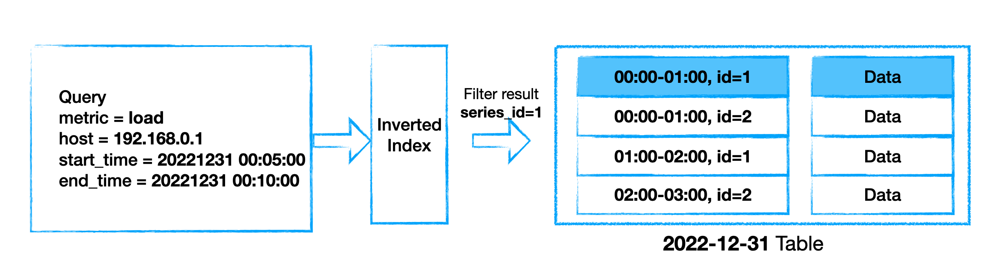
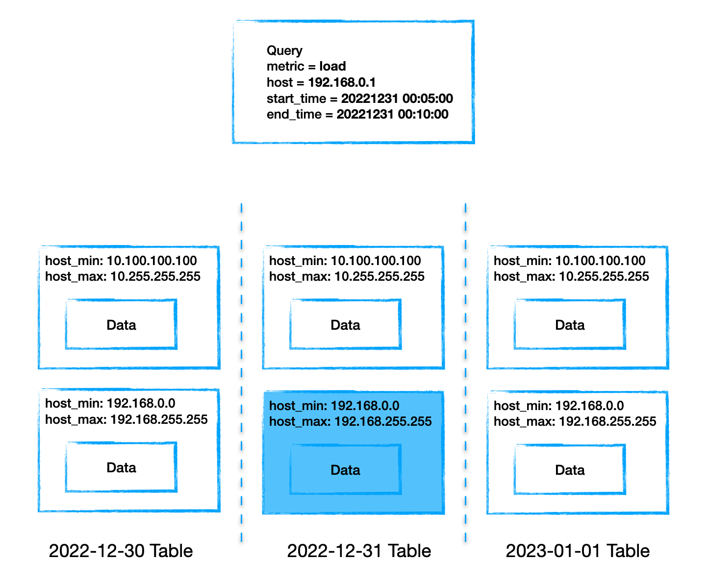
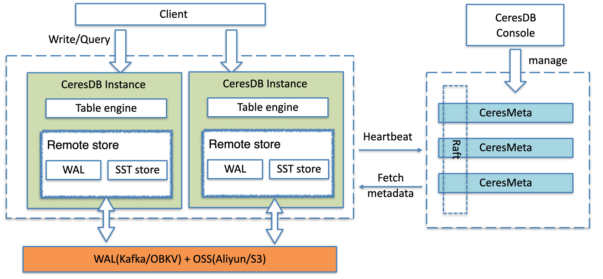
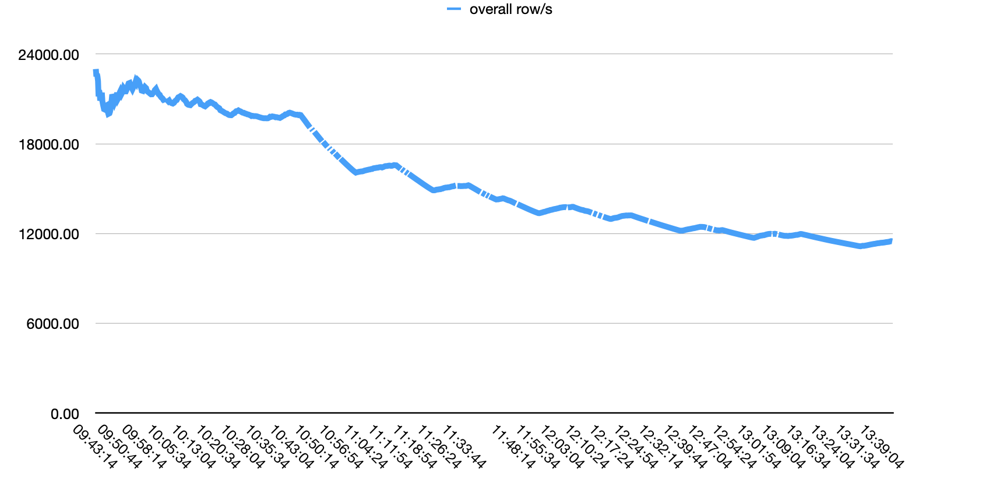
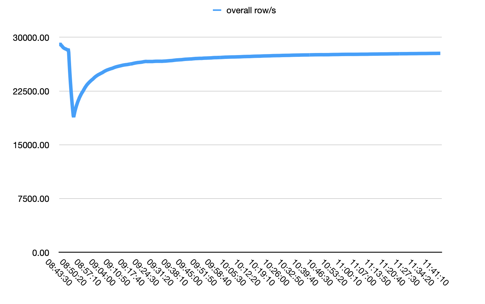

> After nearly a year of open-source development work, we are pleased to announce that the v1.0 of CeresDB, a time-series database aiming to handle analytical and time-series workloads, is officially released and ready for production.

- GitHub repository: https://github.com/CeresDB/ceresdb
- Documentation: https://docs.ceresdb.io

# Design goals
The CeresDB team has been working in the field of time series DBMS for over 5 years. However, with the deepening of research in this field and the growing complexity of user scenarios, we found that some technical problems have not been well addressed by classic time series databases, including:
- Efficiently Store/Query time series data with high cardinality;
- Provide a modern and perfect distributed solution;

Therefore, the CeresDB open-source project was launched with a lofty goal, aiming to be a next-generation cloud-native time-series database. It is expected to handle both traditional time series workloads (low-cardinality tag combinations) and analytical workloads (high-cardinality tag combinations) efficiently.
Also, CeresDB should be able to scale from a single node to a modern distributed system, whose features include high availability, horizontal scalability, load balancing, and so on.

Along with the guidance of the design goal and a year of intensive development, the v1.0 of CeresDB we just released has implemented the basics of the above-mentioned design features. And the APIs are also stable and have been strictly tested.

# Introduction to the key features of CeresDB v1.0
## Storage Engine
- Basic support of columnar storage format and experimental hybrid storage format;
- Besides the fundamental min-max indexes, advanced indexes (e.g. [xor filter](https://arxiv.org/abs/1912.08258)) are supported for pruning;
- Background compaction with time window strategy;

## Distribution
- Support the separation of compute and storage (object store for historical data, OBKV-based or Kafka-based WAL for newly-written data);
- Support hash partitioned table;

## Deployment and Operations
- Support the distributed cluster deployment with or without CeresMeta;
- Support Prometheus + Grafana for self-monitoring;

## Protocol
- Support SQL query and write;
- Provide an efficient write protocol for massive data ingestion based on gRPC;
- Integrate with Prometheus, can be used as remote stroage;

## SDK
- Provide SDK in four languages: Java, Python, Go, Rust;

# Introduction to the technical designs
Here is a brief introduction to some technical designs in CeresDB, and for more details, please refer to our [docs](https://docs.ceresdb.io/).

## Storage Engine
The classic time series model uses an inverted index to organize data. However, in some scenarios, such as monitoring pods with a short lifecycle, IoT, the inverted index may be huge(referred to as "cardinality explosion"), which leads to poor write/query performance:

- The complexity of the inverted index causes poor write performance;
- The poor selectivity of the inverted index causes poor query performance;

The following figure is a diagram explaining the time series model:

Inspired by InfluxDB IOx and some analytical databases, the following methods are adopted in CeresDB to solve the problem caused by high cardinality:
- Column storage;
- Partition scanning + pruning;

The following figure shows the internal data organization of CeresDB:

And besides the analytical workload (data with high cardinality), it's also important to handle the normal time-series workload well. CeresDB extends the methods above:
- Column storage + **hybrid storage**;
- Partition scanning + pruning + **efficient filters**;

Currently, **hybrid storage** is an experimental storage format trying to store time series data more compactly for better query performance. And the **efficient filters** tries to introduce some filters to help prune partition, including the **XOR** filter (an alternative to the bloom filter), inverted index may also be added if the workload suits it.

## Cluster
CeresDB cluster uses an architecture separating storage and computing, as shown in the figure below. Under this architecture, the CeresDB instances do not need to store data locally. And many key distributed features can be implemented easily, including elastic scaling of computing and storage, high availability of services, load balancing, and so on.

A CeresDB cluster consists of the following parts:
- CeresMeta: the metadata center of the cluster, responsible for the overall scheduling of the cluster;
- CeresDB: the CeresDB instances, which are responsible for time series data organization and storage;
- WAL Service: used to store data written in real-time;
- Object Storage: used to store SST files generated from memtable;

As for details of the cluster scheme, please refer to the [doc](https://docs.ceresdb.io/en/design/clustering.html).

# Performance optimization and benchmark

CeresDB aims to efficiently handle analytical workloads (data with high cardinality) and time-series workloads. And here is a brief introduction to the performance optimization work and evaluation of CeresDB.

## Write
CeresDB adopts an LSM-like (Log-structured merge-tree) writing model, which does not need to write complex inverted indexes when writing, so the writing performance is better.

## Query
The following methods, which are mentioned briefly above, are used to improve query performance:

### Pruning with efficient filters
Filters help prune the data blocks:
- Min-Max filter: the construction cost is relatively low, and it performs well in some scenarios;
- XOR filter: a filter similar to and better than bloom filter. It improves the pruning results in specific scenarios;

### Efficient scanning
- Concurrency among multiple SST: scan multiple SST files at the same time;
- Internal concurrency of a single SST: scan row groups of an SST in parallel;
- Merge small IO: for files on remote storage, merge small IO requests to improve downloading efficiency;
- Local cache: cache files pulled from remote storage, including memory and disk cache;

## Benchmark
Performance evaluation is made by [TSBS](https://github.com/CeresDB/tsbs). The data model is as follows:
- 10 Tags
- 10 Fields
- Total number of time series: 100w

Software for benchmark:
- Machine: Linux 24c90g
- InfluxDB version: 1.8.5
- CeresDB version: 1.0.0

### Write performance
Since InfluxDB needs to maintain an index when ingesting data, its performance gradually degrades over time. On the contrary, the ingestion throughput of CeresDB tends to be stable after a short drop, and the overall writing performance is more than 1.5 times that of InfluxDB.

The first figure is InfluxDB, the second is CeresDB:
> PS: A single row contains 10 fields.

### Query performance
Under low selectivity condition (condition: `os=Ubuntu15.10`), CeresDB is 26 times faster than InfluxDB, the performance results are as follows:
- CeresDB query time: 15s
- InfluxDB query time: 6m43s

While with high selectivity conditions (condition: `hostname=[8 hosts]`), the inverted index will be more efficient theoretically. In practice, InfluxDB performs better and is 5 times faster than CeresDB:
- CeresDB: 85ms
- InfluxDB: 15ms

# 2023 Road map
In 2023, after the release of CeresDB v1.0, most of our work will focus on performance, clustering, and the ecosystem of CeresDB.

## Performance
- Explore new storage formats;
- Introduce different types of indexes to enhance the performance of CeresDB under different workloads;

## Clustering
- Automatic load balancing;
- Improve availability and reliability;

## Ecosystem
- Protocol compatibility, including compatibility with popular time-series database protocols such as PromQL, InfluxQL, and OpenTSDB;
- Operation and maintenance tools: including support for k8s, CeresDB standalone operation and maintenance tool, self-monitoring, etc.;
- Developer tools: including data import and export, etc.;

# Community
The CeresDB project has been an open-source project licensed under the Apache 2.0 license since its inception. We have drawn much inspiration from other fantastic open-source projects, such as [InfluxDB IOx](https://github.com/influxdata/influxdb_iox), [DataFusion](https://github.com/apache/arrow-datafusion), and [TiKV](https://tikv.org). We also try to make contributions to the open-source communities in various ways:
- We have contributed several PRs to open-source projects that we've adopted, such as [DataFusion](https://github.com/apache/arrow-datafusion), [Arrow](https://github.com/apache/arrow-rs), and [Parquet](https://github.com/apache/arrow-rs/tree/master/parquet).
- We open-sourced [sqlness](https://github.com/ceresdb/sqlness)  an ergonomic, opinionated framework for SQL integration tests.
- We have kept up with and adopted Rust Nightly to help the Rust community reproduce and verify issues.

The CeresDB team appreciates any contributions from the open-source community to help improve the further evolution of the project. Contributions can be in various forms, such as ideas, feedback, technical discussions, code contributions, and the like. The CeresDB team is committed to creating a vibrant and creative open-source community. We encourage everyone to take part in this journey. Your participation will be highly valued and appreciated.

# Connect with us:
- Email: ceresdbservice@gmail.com
- Join our [slack channel](https://join.slack.com/t/ceresdbcommunity/shared_invite/zt-1dcbv8yq8-Fv8aVUb6ODTL7kxbzs9fnA)
